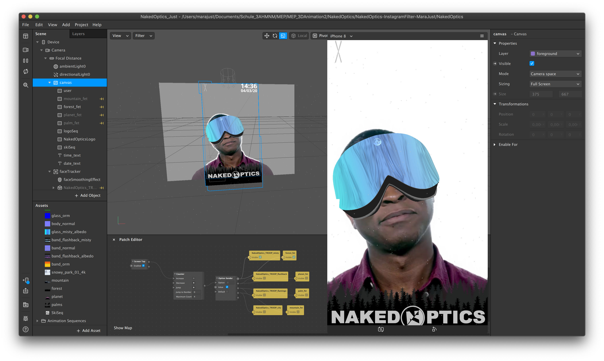
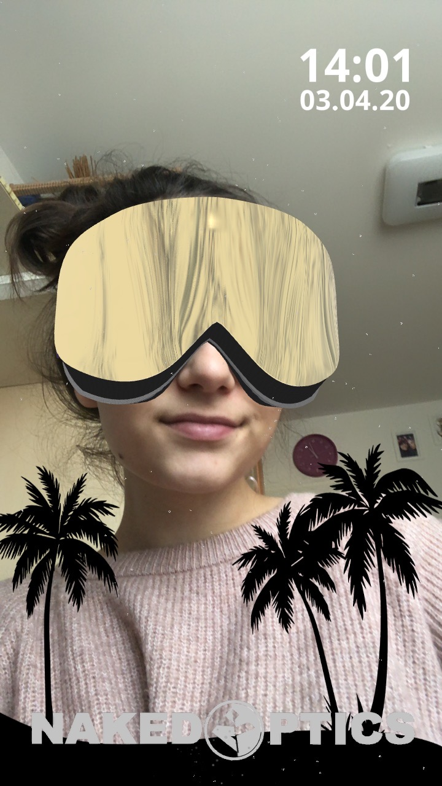

# NakedOptics-InstagramFilter-MaraJust

## Project Description

Instagram Filter for Ski Masks of Naked Optics

## Visuals

### Screenshots:

### Screenvideo:

#### Moodboard:

comic ski goggles: https://www.google.com/search?q=skibrille+comic&client=safari&rls=en&sxsrf=ALeKk00IWESHq_2FmFvQ7hKS0ShSGM-scg:1582818701696&source=lnms&tbm=isch&sa=X&ved=2ahUKEwjbjdWTi_LnAhWS2KQKHSIhD6YQ_AUoAXoECAsQAw&biw=1680&bih=879#imgrc=fnD4x1jqOCfneM

snowy mountains in comic style: https://www.google.com/search?q=comic+snowy+mountains&tbm=isch&ved=2ahUKEwi6of2bgPLnAhUC3RoKHdQACpUQ2-cCegQIABAA&oq=comic+snowy+mountains&gs_l=img.3...5461673.5463618..5463922...0.0..0.74.557.8......0....1..gws-wiz-img.nzfvA1OUZho&ei=FtpXXrq-FIK6a9SBqKgJ&bih=904&biw=1680&client=safari#imgrc=NsDVOoNt68SKUM&imgdii=lNnquO8e8z1jQM

## Software:

Maya 2019; Spark AR Studio v85.0.0.25.237; Visual Studio Code Version: 1.43.2; Adobe AfterEffects 2020; Adobe Illustrator 2020; Adobe Photoshop CC 2019

## Concept

small snow particles in for- and background; 
through tab the ski mask and the current theme should change (4 different textures and themes);
time and date in the right top corner - on the other side is a small pair of animated ski;
NakedOptics logo on the bottom;
Naked Optics logo is animated as a little eye catcher;

### Idea

1. (3D) snowy mountains in the background; snow; time in the top right corner; 
2. ski music like "Schi foarn" etc. in the background
3. HDRI Background
4. Illustrator picture (of mountains) in background; snow; time in the top right corner; 

## References

### Objects:
NakedOptics ski goggles (modeled by Wilfred Gruber): https://github.com/3ahmnm1920-mep3/NakedOptics-InstagramFilter-GRUW

### Youtube:
Layers: https://www.youtube.com/watch?v=TnWrJoPCfco
Date or time: https://www.youtube.com/watch?v=ZmIoWlVN_m0

### Bilder:
Snowy Mountains: https://www.google.com/search?q=winter+mountain+wallpaper&client=safari&rls=en&sxsrf=ALeKk02zfYRyUYRjpZYgkYy2O7qoGQojiA:1582213913797&tbm=isch&source=iu&ictx=1&fir=SXWxLPFZt6a_pM%253A%252CF0Kz5uy5dfM87M%252C_&vet=1&usg=AI4_-kRwjPkyotoFMlB5ycDaiKOZpvPcQw&sa=X&ved=2ahUKEwiy-qiSvuDnAhVZwAIHHUbmDTIQ9QEwAnoECAoQCA#imgrc=SXWxLPFZt6a_pM:

Snowflake: https://www.google.com/search?q=snow+icon+transparent&tbm=isch&ved=2ahUKEwiwtPaiwODnAhWQqbQKHW3KAJEQ2-cCegQIABAA&oq=snow+icon+transparent&gs_l=img.12...0.0..21488...0.0..0.0.0.......0......gws-wiz-img.CGXn8qAgLsc&ei=Va1OXvC1HZDT0gXtlIOICQ&bih=882&biw=1680&client=safari#imgrc=mizAzdF340pp3M

HDRI: https://hdrihaven.com/hdri/?c=midday&h=snowy_park_01

> Theme pictures are all without license so they can be used on the official filter without copyright problems!

Firs forest shapes: https://www.freepik.com/free-photos-vectors/pine
Edit by me

Moutain theme: Photo and edit made by me

Planet theme: https://www.freepik.com/free-photo/3d-space-scene_1077125.htm#page=1&query=planet&position=28
Edit made by me

Palm theme: https://www.freepik.com/free-vector/gradient-beach-sunset-landscape-background_4917074.htm#page=1&query=palm%20trees&position=44
Edit made by me

© copyright by Mara Just 2020